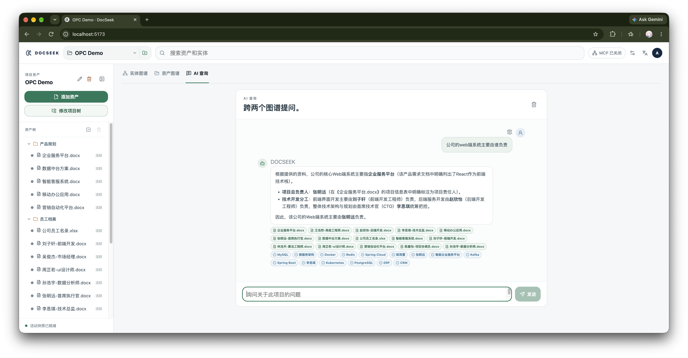
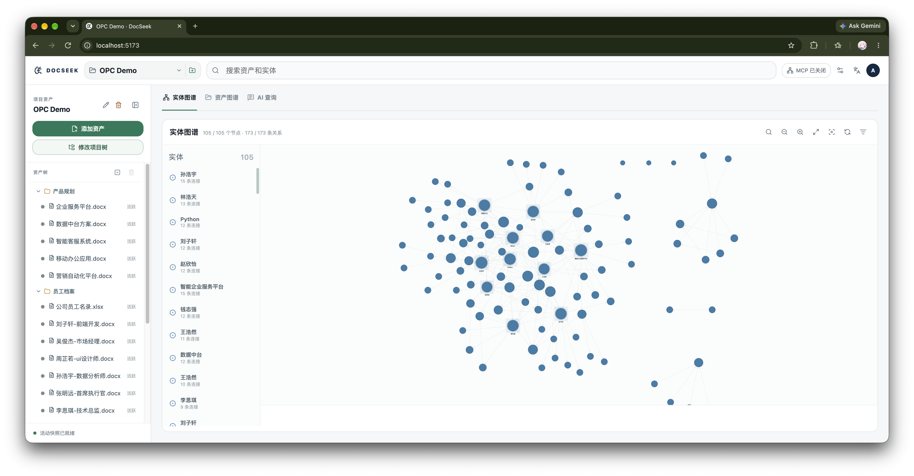
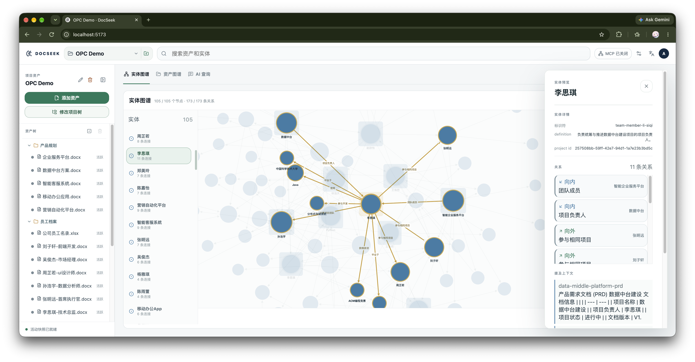

# DocSeek

[English README](README.en-US.md)

## 简介

DocSeek 是一个可自托管的知识工作台：上传文档或其他资产后，系统会提取内容，构建资产图谱与实体图谱，并提供可追溯引用的搜索和 AI 查询。

## 快速开始

环境要求：`uv`、Node.js 20+、npm 和 Git。

```bash
git clone https://github.com/ATreep/DocSeek.git
cd DocSeek
uv python install 3.12
uv sync --group dev
npm --prefix frontend install
./start.sh
```

启动完成后访问 <http://localhost:5173>，使用本地开发账号 `admin` / `admin` 登录。首次登录后请立即修改密码；不要在未加固的情况下将开发服务暴露到公网。

`start.sh` 会启动 API（默认 `http://127.0.0.1:8000`）和前端，并将运行数据写入 `data/`。如果使用 Neo4j，请在启动前配置 `DOCSEEK_NEO4J_*` 环境变量；未配置时会使用本地 JSON 图谱回退存储。

## 主要功能

- **资产导入与解析**：支持文本、PDF、Office 文档等常见格式，保留项目和资产层级。
- **资产图谱**：展示资产之间的关系，支持筛选、搜索、缩放、聚焦和重新布局。
- **实体图谱**：从资产内容中提取实体、定义和关系，并保留来源资产。
- **搜索与 AI 查询**：在资产和实体中检索；AI 查询基于图谱证据回答，并提供引用和关系路径。
- **项目级 MCP**：按项目启用或关闭 MCP 端点，供兼容客户端调用。
- **权限与多语言**：内置用户、群组、角色和能力管理，界面支持中英文切换。
- **本地优先部署**：Neo4j 可选；未连接 Neo4j 时仍可使用本地回退存储快速体验。

## 界面截图

完整截图目录：[screenshots/](screenshots/)

### AI 查询



### 实体图谱总览



### 实体关系预览



## 开发验证

```bash
uv run pytest -q
npm --prefix frontend test
npm --prefix frontend run build
```

## 许可证

本项目使用 [GPL-3.0](LICENSE) 许可证。
