# DocSeek Release 1 Product Requirements Document

Date: 2026-08-15
Status: Draft for user review
Related design: `docs/superpowers/specs/2026-08-15-docseek-top-level-design.md`

## 1. Product Summary

DocSeek is a self-hosted knowledge-base management and query system for one enterprise, organization, or person per deployment. It turns uploaded files into structured, searchable knowledge through LLM, RAG, GraphRAG, and AI Agent workflows.

The product treats every uploaded file as a **property**. A property receives a concise definition, a smart-tree location, vector representations, and related entities. Properties and entities are exposed through a unified React WebUI and through an MCP server that uses the same permissions as the WebUI.

Release 1 is a complete product release. It includes ingestion, agent processing, project management, graph views, AI Query, local authentication, role-based permissions, user administration, System Configuration, and MCP. Audit is not part of the product.

## 2. Product Vocabulary

| Term | Product meaning |
| --- | --- |
| Property | An uploaded file and its managed revisions, such as Markdown, PDF, Word, HTML, code, or image content. |
| Property Pool | The current set of properties in one project. |
| Definition | A concise one-sentence description of a property generated by DG-Agent and refined by user comments. |
| Attribute | The property metadata shown in Property Attribute, including its definition and related entity list. |
| Entity | A person, product, module, team, concept, or other named object extracted from properties. |
| Entity Pool | The canonical set of entities in one project, stored in SQLite. |
| Property Graph | GraphRAG projection containing properties and their relationships. |
| Entity Graph | GraphRAG projection containing entities and their relationships. |
| Project | An independent knowledge corpus stored under `projects/<project-id>/`. |
| Active snapshot | The last complete and internally consistent project state across SQLite, GraphRAG, vector data, and indexes. |
| Processing status | Current operational worker state used for progress, recovery, and retry. It is not an audit history. |

## 3. Goals

### 3.1 Release 1 goals

1. Let a user create a project and import supported properties.
2. Generate useful definitions, meaningful filename suggestions, entities, entity edges, smart grouping, vectors, and graph projections automatically.
3. Keep the project internally consistent by preventing property mutations while its worker pipeline is running.
4. Let users inspect the complete Property Graph and Entity Graph for the selected project.
5. Let users ask source-grounded AI questions with citations back to properties.
6. Let superusers configure multiple providers and select an LLM/embedding route independently for each agent.
7. Provide local accounts, groups, built-in roles, custom roles, and global action-level permissions.
8. Expose authorized WebUI capabilities through MCP with identical authorization behavior.
9. Recover safely after worker or server interruption without losing the last active project snapshot.

### 3.2 Explicit non-goals

- No audit timeline, compliance review workflow, or audit-report subsystem.
- No multi-tenant SaaS control plane in release 1.
- No project-specific ACLs; project permissions are global capabilities.
- No automatic silent rename when DG-Agent suggests a filename.
- No requirement to support multiple deployment servers as one cluster.
- No second business-logic implementation for MCP.

## 4. Actors and Access Model

### 4.1 Actors

| Actor | Responsibilities |
| --- | --- |
| Unauthenticated visitor | Can only reach the login surface. |
| Authenticated user | Uses permitted project, property, graph, and query capabilities. |
| Project manager | Creates, renames, and deletes projects when assigned those capabilities. |
| Knowledge editor | Uploads, replaces, edits, moves, renames, and deletes properties when assigned. |
| Knowledge analyst | Reads properties, attributes, graphs, and runs AI Query when assigned. |
| Superuser | Immutable built-in role with every capability, including user, group, role, and System Configuration management. |
| MCP caller | Uses an authenticated MCP identity and receives the same effective capabilities as that identity in the WebUI. |

### 4.2 Role inheritance

Permissions are assigned to roles. Roles are assigned to groups. Users may belong to multiple groups and receive the union of all role grants. There are no direct user grants and no deny rules in release 1.

Built-in role templates include Superuser, Project Manager, Knowledge Editor, Knowledge Analyst, and Reader. Administrators may create custom roles. Superuser is immutable and cannot be edited, removed, or deprived of capabilities through the WebUI.

## 5. Whole-Interface Information Architecture

The React shell has one project workspace and a set of top-level administrative routes. The project workspace intentionally keeps the left panel dedicated to the property tree.

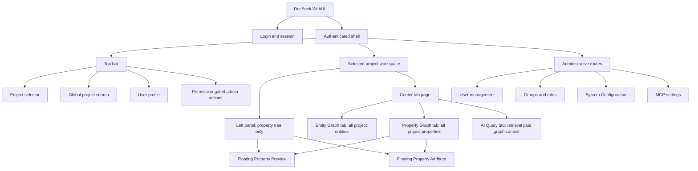

### 5.1 Global shell rules

- The project selector changes the entire selected-project context.
- The left panel never becomes a second navigation tree for entities or saved investigations.
- The center tab remains mounted as one workspace and switches among Entity Graph, Property Graph, and AI Query.
- Floating Property Preview and Property Attribute windows open from a property-tree or Property Graph selection.
- Admin routes are hidden or disabled when the user lacks their capabilities.
- During processing, read operations remain available but all property mutation controls are disabled.

### 5.2 Spatial UI Layouts

The following Mermaid diagrams are structural wireframes. They define placement and containment of UI regions; typography, colors, spacing, and responsive breakpoints belong to the implementation plan.

#### 5.2.1 Whole authenticated shell

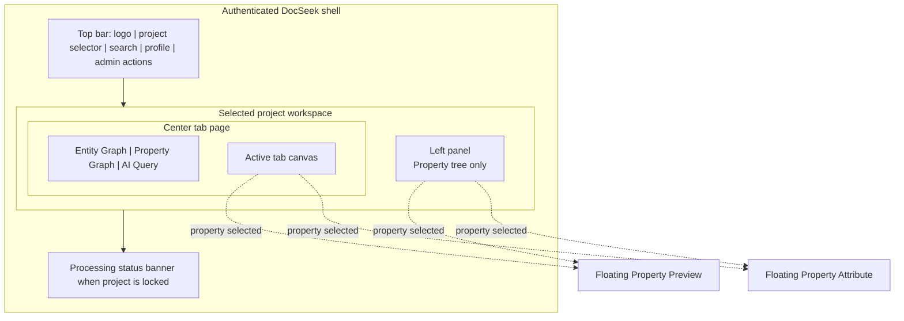

#### 5.2.2 Login and session layout

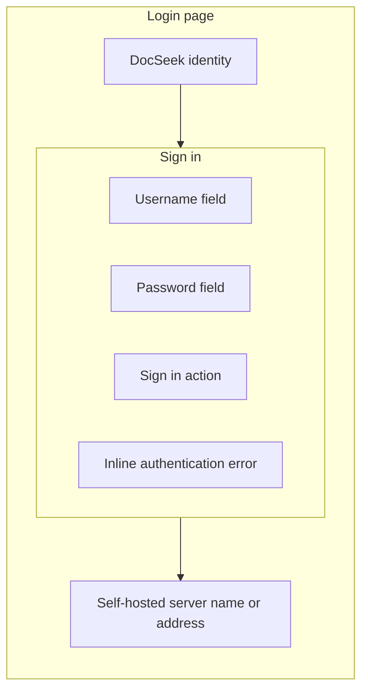

#### 5.2.3 Project management layout

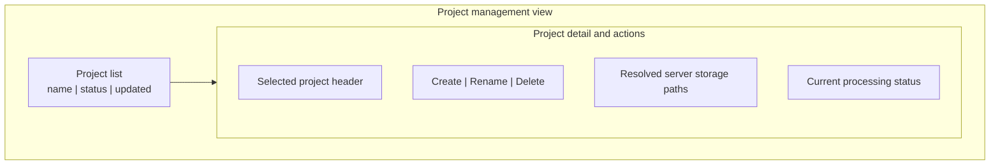

#### 5.2.4 Property tree with floating windows

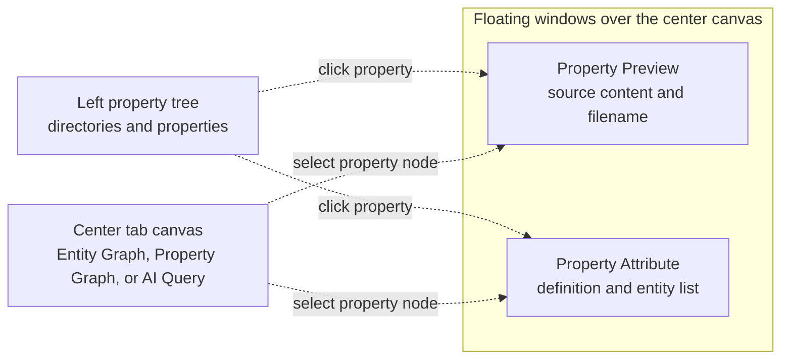

#### 5.2.5 Processing status layout

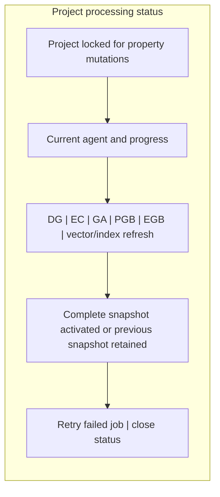

#### 5.2.6 Entity Graph tab layout

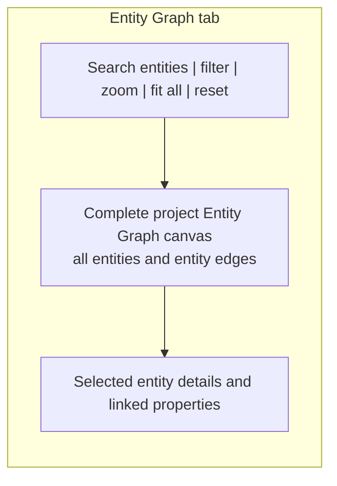

#### 5.2.7 Property Graph tab layout

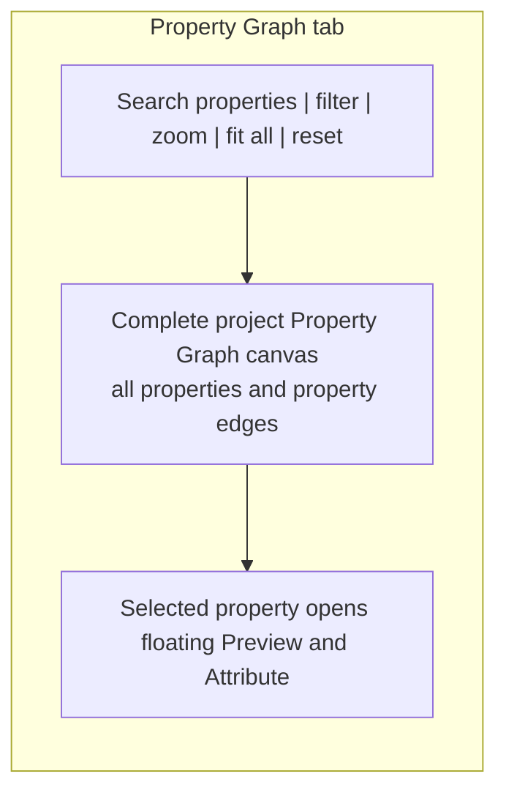

#### 5.2.8 AI Query tab layout

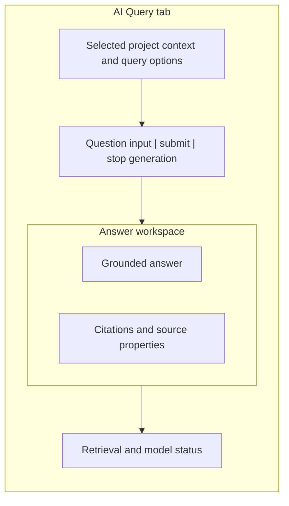

#### 5.2.9 System Configuration layout

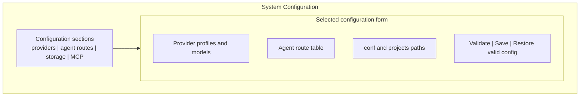

#### 5.2.10 User, group, and role management layout

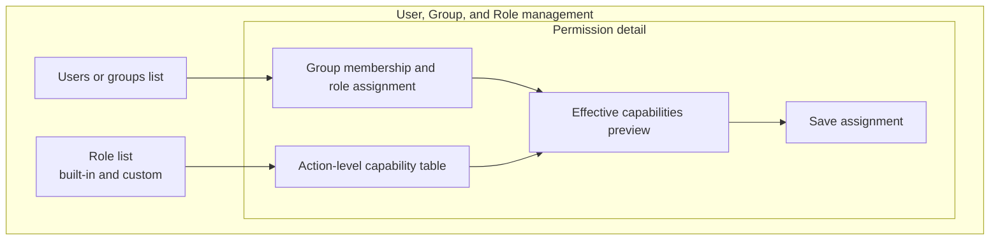

#### 5.2.11 User profile layout

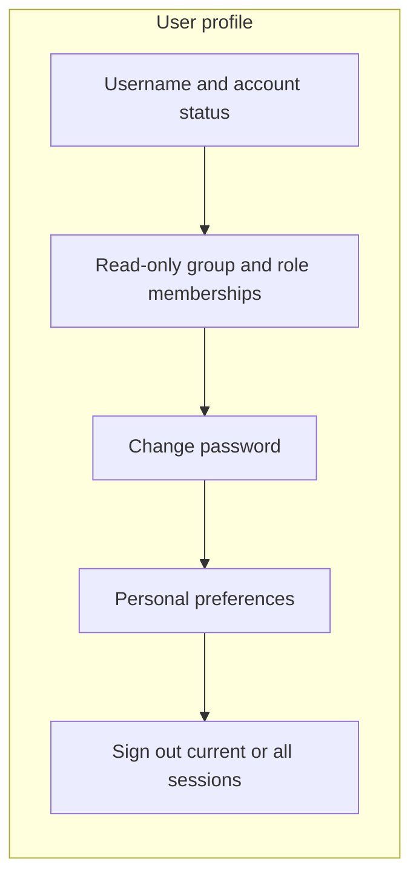

#### 5.2.12 MCP settings layout

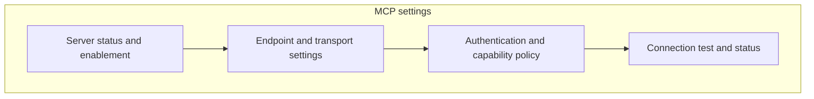

## 6. Module Requirements and UI Designs

Each module below defines its responsibility, primary UI, and release-1 requirements.

### 6.1 Authentication and Session Module

**Purpose:** Establish local user identity before any project or administrative view is accessible.

**Requirements:**

- Provide username/password login backed by the server-local configuration store.
- Establish a session containing user identity, group membership, effective role grants, and capability claims.
- Expire or revoke sessions when a user is disabled.
- Never expose password material through the WebUI, API, or MCP.
- Redirect unauthenticated requests to login and preserve the intended route when safe.

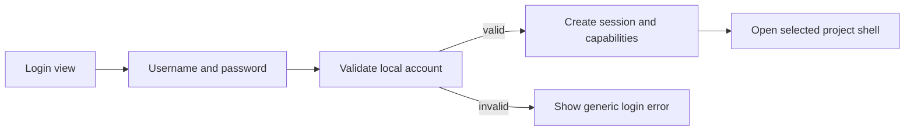

### 6.2 Project Management Module

**Purpose:** Create and maintain independent project corpora on the server.

**Requirements:**

- List all projects visible through `project.view`.
- Create a project only with `project.create`.
- Validate a project name and generate a stable project ID.
- Create the project directory layout and initial SQLite/GraphRAG/vector stores.
- Rename or delete a project only with the corresponding capabilities.
- Prevent deletion while the project is processing.
- Make every project accessible to every authorized user; do not add project-specific ACLs.

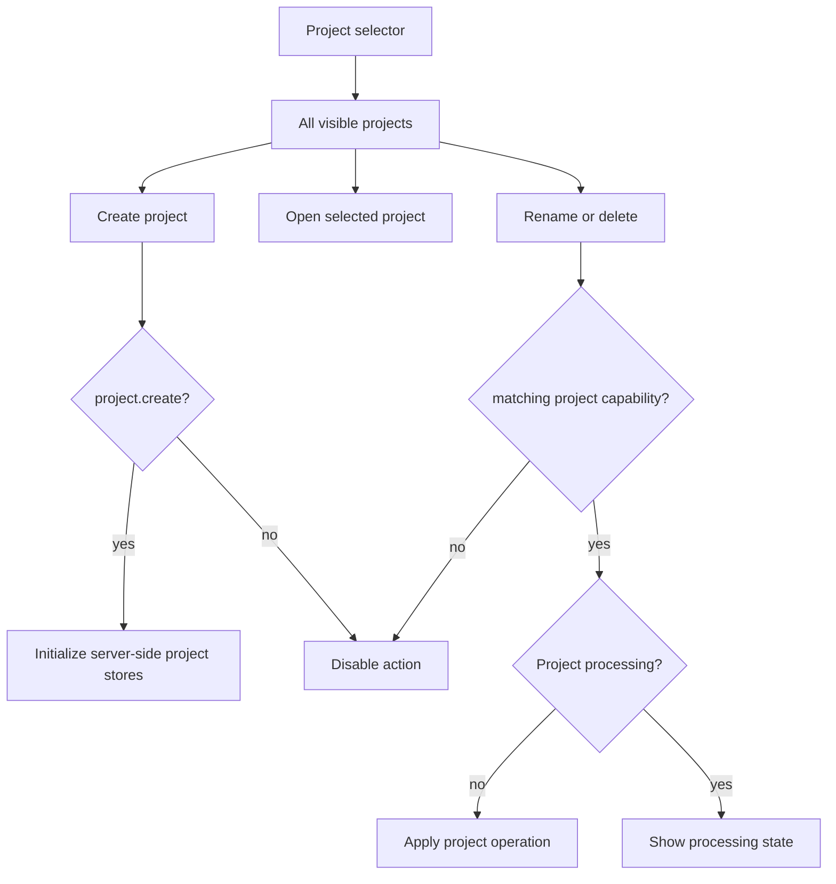

### 6.3 Property Tree and Ingestion Module

**Purpose:** Maintain the project property pool and provide the primary navigation surface.

**Requirements:**

- Accept Markdown, PDF, Word, HTML, code, image, and other configured parsers.
- Store the original file on the server under the selected project.
- Add newly uploaded properties to the tree through GA-Agent.
- Allow Replace, WebUI edit, Save, rename, move, and delete only with matching capabilities and no active project lock.
- Allow manual comments that DG-Agent receives as definition-generation context.
- Show a processing banner and disable all property mutations while workers are active.
- Show the DG-Agent filename suggestion after processing and let the user accept or revise it explicitly.

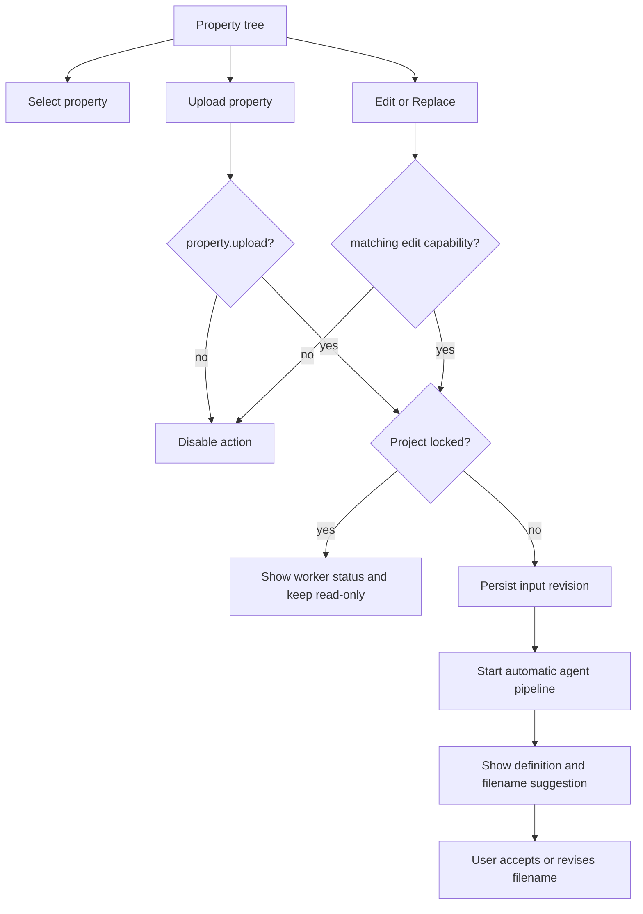

### 6.4 Property Preview Module

**Purpose:** Show the original property content without changing project navigation.

**Requirements:**

- Open as a floating window when a property is clicked in the tree or Property Graph.
- Render supported document types using the configured parser/previewer.
- Provide source metadata, current filename, processing status, and a link to Property Attribute.
- Expose edit/Replace actions only when the project is unlocked and capabilities allow them.
- Keep the last readable active snapshot visible during processing or failure.

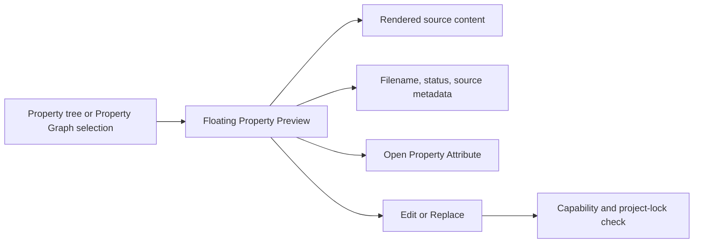

### 6.5 Property Attribute Module

**Purpose:** Explain a property in compact form and expose its entity associations.

**Requirements:**

- Open as a floating window from the property tree or Property Graph.
- Show the DG-Agent definition and the property attribute record.
- Show the entity list through SQLite foreign-key relationships.
- Show processing state and the active snapshot represented by the displayed data.
- Allow manual attribute edits only with `property.attribute.edit` and only while the project is unlocked.
- A manual Save is a property mutation and starts the automatic pipeline.

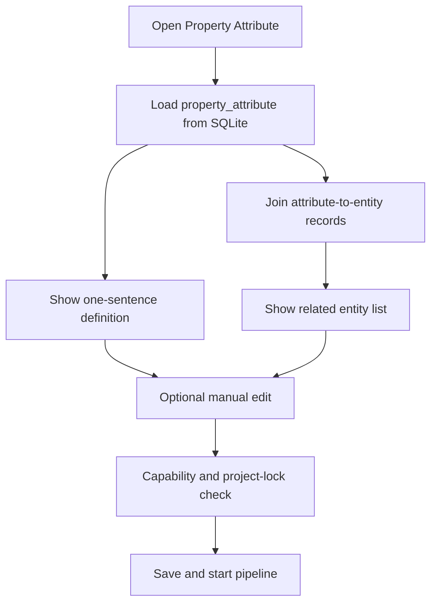

### 6.6 Agent Orchestration and Processing Status Module

**Purpose:** Coordinate DG-Agent, EC-Agent, GA-Agent, PGB-Agent, and EGB-Agent as one consistent project update.

**Requirements:**

- Create one project job for each explicit property mutation.
- Persist queued/running/complete/interrupted/failed state in the project SQLite database.
- Persist current stage, timestamps, heartbeat, retry information, and concise failure details.
- Capture each agent's configured provider/model route at job start.
- Enforce the project-wide mutation lock.
- Build candidate derived data in staging locations and atomically activate only a complete snapshot.
- Expose status to WebUI and authorized MCP operations.

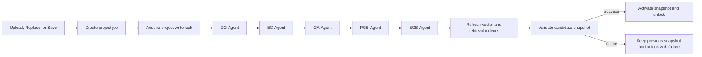

### 6.7 Property Graph Module

**Purpose:** Visualize all properties and their graph relationships for the selected project.

**Requirements:**

- Render every property node in the selected project by default.
- Read graph nodes and edges from the single project GraphRAG database.
- Allow search, filtering, zoom, focus, and reset without mutating graph data.
- Open Property Preview and Property Attribute for a selected property node.
- Show processing state and retain the last active snapshot during worker processing.

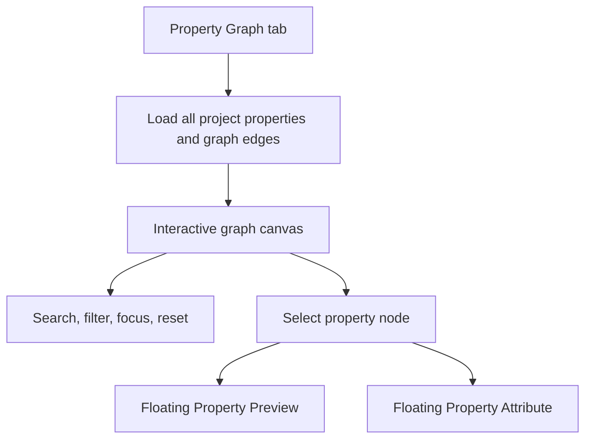

### 6.8 Entity Graph Module

**Purpose:** Visualize all entities and entity relationships for the selected project.

**Requirements:**

- Render every entity node in the selected project by default.
- Read entity graph nodes and edges from the single project GraphRAG database.
- Make aggregation entities visible, such as Product and Staff nodes connecting related entities.
- Allow search, filtering, zoom, focus, and reset without mutating graph data.
- Selecting a property-linked context opens the same floating property windows.

```mermaid
flowchart TB
  TAB["Entity Graph tab"] --> LOAD["Load all project entities and entity edges"]
  LOAD --> CANVAS["Interactive entity graph canvas"]
  CANVAS --> FILTER["Search, filter, focus, reset"]
  CANVAS --> ENTITY["Select entity"]
  ENTITY --> RELATED["Show related properties and entities"]
  RELATED --> PREVIEW["Open floating property windows when a property is selected"]
```

### 6.9 AI Query Module

**Purpose:** Answer natural-language questions using project properties, vectors, definitions, and graph context.

**Requirements:**

- Accept a question and optional query context from the selected project.
- Retrieve relevant chunks from the vector store.
- Retrieve relevant property and entity context from GraphRAG.
- Route the request to the configured AI Query LLM.
- Return an answer with citations linking to source properties and, where useful, entities.
- Show query progress and provider failures without blocking read-only graph browsing.
- Enforce `query.execute` for WebUI and MCP.

```mermaid
flowchart TB
  QUERY["AI Query tab"] --> ASK["Enter question"]
  ASK --> VECTOR["Vector retrieval"]
  ASK --> GRAPH["Property and Entity Graph retrieval"]
  VECTOR --> CONTEXT["Assemble grounded context"]
  GRAPH --> CONTEXT
  CONTEXT --> LLM["Configured AI Query LLM"]
  LLM --> ANSWER["Answer with citations"]
  ANSWER --> SOURCE["Open cited Property Preview or Attribute"]
```

### 6.10 System Configuration Module

**Purpose:** Configure server-wide provider routing and storage paths.

**Requirements:**

- Create, edit, validate, enable, and disable LLM provider profiles.
- Create, edit, validate, enable, and disable embedding provider profiles.
- Select an LLM/embedding route independently for each agent.
- Display the `conf/` and project-root paths and validate server permissions.
- Configure MCP server enablement and endpoint settings when `mcp.configure` is granted.
- Prevent provider changes from modifying a running job; active jobs retain their captured routes.

```mermaid
flowchart TB
  SETTINGS["System Configuration"] --> PROVIDERS["LLM and embedding profiles"]
  SETTINGS --> ROUTES["Per-agent model routes"]
  SETTINGS --> STORAGE["conf and projects paths"]
  SETTINGS --> MCP["MCP server settings"]
  PROVIDERS --> TEST["Validate connection and model"]
  TEST --> SAVE["Persist valid configuration"]
  ROUTES --> SAVE
  STORAGE --> VALIDATE_PATH["Validate read/write access"]
  VALIDATE_PATH --> SAVE
  MCP --> SAVE
```

### 6.11 User, Group, and Role Management Module

**Purpose:** Manage local identities and global action-level permissions.

**Requirements:**

- Create, disable, enable, and update local users with `user.manage`.
- Create groups and assign users with `group.manage`.
- Create custom roles and assign capabilities with `role.manage`.
- Assign roles to groups; do not assign permissions directly to users.
- Show effective capabilities derived from all group memberships.
- Keep Superuser immutable and always fully privileged.
- Restrict the entire module to the Superuser role in the default configuration.

```mermaid
flowchart LR
  ADMIN["User management"] --> USERS["Users"]
  ADMIN --> GROUPS["Groups"]
  ADMIN --> ROLES["Roles and capabilities"]
  USERS --> MEMBERSHIP["User belongs to groups"]
  GROUPS --> MEMBERSHIP
  GROUPS --> ROLE_BINDING["Group receives roles"]
  ROLES --> ROLE_BINDING
  ROLE_BINDING --> EFFECTIVE["Effective global capabilities"]
  EFFECTIVE --> POLICY["WebUI and MCP authorization"]
```

### 6.12 User Profile Module

**Purpose:** Let the current user manage personal settings without exposing system administration.

**Requirements:**

- Show the current username, group memberships, and effective role names.
- Allow password change and session sign-out.
- Store user-specific preferences in `conf/`.
- Never allow a user to self-assign roles, capabilities, or Superuser status.

```mermaid
flowchart TB
  PROFILE["User profile"] --> IDENTITY["Identity and memberships"]
  PROFILE --> PASSWORD["Change password"]
  PROFILE --> PREFS["Personal preferences"]
  PROFILE --> SIGNOUT["Sign out sessions"]
  PASSWORD --> AUTH_STORE["Persist in conf auth/config store"]
  PREFS --> CONF_STORE["Persist in conf"]
```

### 6.13 MCP Settings and Server Module

**Purpose:** Expose selected DocSeek capabilities to third-party LLM Agents without bypassing policy.

**Requirements:**

- Allow an authorized administrator to enable or disable the server.
- Display endpoint and connection status.
- Use the authenticated caller's roles and capabilities for every operation.
- Expose project browsing, property retrieval, graph retrieval, and AI Query only when underlying capabilities permit them.
- Return source references that resolve to the same properties shown in the WebUI.

```mermaid
flowchart TB
  MCP_SETTINGS["MCP settings"] --> ENABLE["Enable or disable MCP"]
  MCP_SETTINGS --> ENDPOINT["Endpoint and connection status"]
  CALLER["Third-party LLM Agent"] --> MCP_SERVER["MCP server"]
  MCP_SERVER --> AUTH["Authenticate caller"]
  AUTH --> MCP_GATE["Check mcp.use"]
  MCP_GATE --> CAP["Check underlying capability"]
  CAP --> SERVICE["Call shared DocSeek domain service"]
  SERVICE --> RESULT["Return authorized data and citations"]
```

## 7. Data and Persistence Requirements

### 7.1 Configuration store

The `conf/` directory contains a server-local configuration store for:

- LLM and embedding provider profiles
- Per-agent provider/model routes
- Project-root and storage settings
- MCP server settings
- Local users, groups, roles, capability assignments, and user preferences

Sensitive values must be stored with filesystem permissions that prevent ordinary users from reading them and must never be rendered in clear text by the UI.

### 7.2 Project SQLite schema

Each project metadata database must support, at minimum:

| Table | Responsibility |
| --- | --- |
| `project_meta` | Project identity, name, active snapshot, and processing lock/status. |
| `property` | Canonical property identity, current filename, source path, and current state. |
| `property_revision` | Processing input and revision linkage without creating a user-facing audit timeline. |
| `property_attribute` | Definition and attribute data for a property revision. |
| `entity` | Canonical entity identity and metadata. |
| `property_attribute_entity` | Foreign-key join from an attribute to its entity list. |
| `property_entity_affiliation` | Canonical metadata association between a property and an affiliated entity. |
| `agent_job` | Durable job state, current stage, heartbeat, retry information, and failure details. |
| `snapshot_manifest` | Candidate/active snapshot references and readiness state. |

Graph traversal edges and graph indexes are stored only in the single project GraphRAG database. The SQLite attribute and affiliation rows are canonical UI metadata; their traversal projections are GraphRAG edges. SQLite IDs are stable references used to join graph results back to canonical metadata.

### 7.3 Derived-store consistency

Every pipeline writes to a candidate snapshot. A snapshot is eligible for activation only when SQLite metadata, GraphRAG data, vector data, and required indexes all report readiness. The active snapshot pointer changes only after those checks. A failed candidate is discarded or retained for retry without replacing the active state.

## 8. Agent Contracts

| Agent | Input | Output |
| --- | --- | --- |
| DG-Agent | Property content, user comment, parser output | Definition, filename suggestion, normalized metadata |
| EC-Agent | Property content/definition, SQLite entity pool, GraphRAG entity context | Entity upserts, entity relationships, property affiliation decisions |
| GA-Agent | Definition, current property tree, project context | Tree placement and meaningful directory-name suggestion |
| PGB-Agent | Updated candidate property pool and grouping metadata | Property Graph nodes, edges, and indexes in GraphRAG DB |
| EGB-Agent | Updated candidate entity pool and entity relationship inputs | Entity Graph nodes, edges, aggregation structure, and indexes in GraphRAG DB |
| AI Query | User question, vector results, graph results, property definitions | Grounded answer and source citations |

Every agent must return a validated structured result or a typed failure. Free-form output that cannot be validated is never published.

## 9. Core User Workflows

### 9.1 Login and open a project

1. User enters local credentials.
2. Server resolves group memberships and effective capabilities.
3. User opens the project selector.
4. User selects any project visible through `project.view`.
5. The project shell opens with the property tree and active center tab.

### 9.2 Create a project

1. User selects Create Project.
2. API checks `project.create`.
3. Server creates the project directory and initial stores.
4. Project appears in the global project selector.

### 9.3 Upload a property

1. User chooses Upload in the property tree.
2. API checks `property.upload` and the project lock.
3. Server writes the original file and creates the processing input.
4. Project lock activates immediately.
5. Agents run and update the candidate snapshot.
6. On success, the complete snapshot becomes active and the project unlocks.
7. User reviews or revises the DG-Agent filename suggestion.

### 9.4 Edit or replace a property

1. User opens Property Preview or Property Attribute.
2. User chooses Edit or Replace.
3. API checks capability and lock state.
4. Save creates new processing input and activates the same pipeline/lock behavior as upload.

### 9.5 Explore graphs and attributes

1. User opens Entity Graph or Property Graph tab.
2. The complete selected-project graph loads from GraphRAG data.
3. User filters or focuses the view.
4. Selecting a property opens Property Preview and Property Attribute floating windows.

### 9.6 Ask AI Query

1. User enters a question in the AI Query tab.
2. Vector retrieval and GraphRAG retrieval run against the active project snapshot.
3. AI Query LLM receives definitions, chunks, graph context, and the user question.
4. UI renders the answer with citations to properties and relevant entities.

### 9.7 Configure providers

1. Superuser opens System Configuration.
2. Administrator creates or validates provider profiles.
3. Administrator selects a provider/model route for each agent.
4. Valid settings are persisted in `conf/`; active jobs retain their original routes.

### 9.8 Manage permissions

1. Superuser opens User/Group/Role management.
2. Administrator creates a user, group, or custom role.
3. Roles receive action capabilities.
4. Groups receive roles.
5. Users receive group membership.
6. The effective capability view confirms the resulting global access.

### 9.9 Use MCP

1. Authorized administrator enables MCP and configures its endpoint.
2. Third-party agent authenticates.
3. MCP checks `mcp.use` and the underlying operation capability.
4. Shared domain services return the same authorized data and citations as WebUI.

## 10. Non-Functional Requirements

- **Deployment:** Must run on one private server with local or mounted storage paths.
- **Consistency:** No property mutation may be accepted while the containing project is processing.
- **Recovery:** A restart must preserve the active snapshot and must not leave a project permanently locked.
- **Security:** Credentials are masked in the UI and protected in the server configuration store. Unauthorized operations fail before data retrieval.
- **Grounding:** AI Query answers must identify source properties and should identify relevant entities when graph context contributes to the answer.
- **Extensibility:** LLM, embedding, vector, parser, and GraphRAG providers are accessed through adapters; per-agent model routes are configuration, not hard-coded logic.
- **Operability:** Processing status, current agent, retry action, and concise failure details are visible to authorized users.
- **Read availability:** Project browsing and the last active snapshot remain readable during processing and after failed candidate updates.

## 11. Release 1 Acceptance Criteria

The release is accepted when all of the following are demonstrable in a self-hosted deployment:

1. A local user can log in and see only capabilities assigned through group roles.
2. A permitted user can create a project, and all users with project access can open it.
3. Supported property files can be uploaded, previewed, replaced, and edited.
4. Upload, Replace, or Save disables all property mutations project-wide until processing completes.
5. DG-Agent produces a definition and a meaningful filename suggestion; the user explicitly controls the final filename.
6. EC-Agent and GA-Agent update SQLite-backed metadata and smart grouping.
7. PGB-Agent and EGB-Agent update the single GraphRAG database, and the vector store is refreshed.
8. Entity Graph shows all project entities and Property Graph shows all project properties by default.
9. Property selection opens floating Property Preview and Property Attribute windows.
10. AI Query combines vector and graph context and returns usable source citations.
11. System Configuration can configure multiple provider profiles and per-agent routes.
12. Superuser can manage users, groups, and custom roles; Superuser cannot be removed or weakened.
13. MCP operations produce the same authorization result as equivalent WebUI operations.
14. Provider failures, invalid agent outputs, worker crashes, and server restarts preserve the last active snapshot and support retry.

## 12. Implementation Tracks

The following tracks are independent enough to receive separate implementation plans while still belonging to one release:

1. Runtime foundation, local auth, configuration store, and authorization policy.
2. Project lifecycle, property storage, SQLite schema, and processing lock.
3. Parser and property workflow, DG-Agent, and GA-Agent.
4. EC-Agent, canonical entity metadata, GraphRAG database projections, and vector indexing.
5. React shell, property tree, floating windows, graph tabs, and AI Query.
6. User/group/role administration, System Configuration UI, MCP settings, MCP transport, and end-to-end verification.
