# DocSeek Release 1 Product Requirements Document

Date: 2026-08-15
Status: Revised draft for user review
Related design: `docs/superpowers/specs/2026-08-15-docseek-top-level-design.md`

## 1. Product Summary

DocSeek is a self-hosted internal knowledge-base management and query system for one enterprise, organization, or person per deployment. It turns uploaded properties into definitions, vectors, a Property Graph, an Entity Graph, and source-grounded answers.

Every uploaded file is a **property**. A property may be a text/document/code file or an image. Text properties provide source documents for Entity Graph extraction. Image properties are recognized by the DG-Agent model, receive a vision-generated definition, are searchable through their definition embedding, appear in the Property Graph, and are excluded from Entity Graph extraction.

Release 1 includes project management, property ingestion/editing, DG-Agent, GA-Agent, PGB-Agent, Neo4j GraphRAG Entity Graph construction, Neo4j Property Graph construction, natural-language Search, AI Query, React WebUI, local accounts, global role permissions, user/group/role administration, System Configuration, and MCP.

EC-Agent and EGB-Agent are not part of the product. Neo4j GraphRAG performs Entity Graph extraction, resolution, and writing.

Audit is explicitly out of scope. Operational processing status is required for locks, recovery, and retries, but DocSeek does not provide an audit timeline or compliance-audit workflow.

## 2. Vocabulary

| Term | Meaning |
| --- | --- |
| Property | An uploaded file and its active managed state. |
| Text property | A property that can be normalized into text and sent to Entity Graph GraphRAG. |
| Image property | A property previewed as an image, described by the DG-Agent model, embedded from that definition, and excluded from Entity Graph input. |
| Definition | A concise description generated by DG-Agent. For images it is generated from image input. |
| Attribute | Definition and related metadata shown in Property Attribute; stored on the Property Graph property node. |
| Property Graph | Neo4j graph in the `property_graph` database. Its nodes are properties; PGB-Agent generates the edges only. |
| Entity Graph | Neo4j graph in the `entity_graph` database. Neo4j GraphRAG extracts and writes entity nodes and relationships from text properties. |
| Search | Embedding and graph retrieval that returns matching Properties and Entities without an LLM. |
| AI Query | Retrieval from both graphs followed by answer generation with the configured LLM. |
| Active snapshot | The last complete graph/vector state that is safe to read. |
| Processing status | Current queued/running/failed/completed worker state; not an audit history. |
| Project | Independent knowledge corpus with a user-entered display name and stable server-side ID. |

## 3. Product Goals and Non-Goals

### 3.1 Goals

1. Let users create and rename named projects.
2. Import text and image properties into a project.
3. Generate property definitions automatically, including vision definitions for images.
4. Build a Property Graph whose nodes are properties and whose edges are generated by PGB-Agent.
5. Build an Entity Graph from all current non-image property text through Neo4j GraphRAG.
6. Search Properties and Entities by natural language using the shared embedding model and graph retrieval, with no LLM invocation.
7. Answer AI Query questions using retrieval from both Neo4j graphs and a configured answer LLM.
8. Keep each project consistent by blocking property mutations during processing.
9. Provide explicit role/group permissions and identical WebUI/MCP capability evaluation.
10. Provide a project-scoped MCP server that the user manually opens and closes.

### 3.2 Non-goals

- No audit timeline, compliance review, or audit report.
- No project-specific ACLs; project capabilities are global.
- No EC-Agent or EGB-Agent.
- No SQLite canonical store for properties, attributes, entities, or graph data.
- No automatic MCP start when opening or switching projects.
- No MCP project-management tools.
- No MCP authentication separate from the active WebUI user; network exposure is intentionally unauthenticated.

## 4. Actors and Permission Model

### 4.1 Actors

| Actor | Behavior |
| --- | --- |
| Unauthenticated visitor | Can only reach Login. |
| Authenticated user | Uses project, property, graph, Search, AI Query, and MCP features permitted by roles. |
| Project manager | Creates, renames, and deletes projects when granted. |
| Knowledge editor | Adds, replaces, edits, moves, renames, and permanently removes properties when granted. |
| Knowledge analyst | Reads properties/attributes/graphs, searches, and asks AI Query questions when granted. |
| Superuser | Immutable built-in role with all capabilities, including user, group, role, and System Configuration management. |
| MCP caller | Network caller using the active project MCP endpoint; receives the capabilities of the WebUI user who opened MCP. |

### 4.2 Role inheritance

Permissions are assigned to roles. Roles are assigned to groups. Users may belong to multiple groups and receive the union of all role capabilities. There are no direct user grants and no deny rules in release 1.

Built-in role templates include Superuser, Project Manager, Knowledge Editor, Knowledge Analyst, and Reader. Administrators may create custom roles. Superuser cannot be edited, removed, or weakened through the WebUI.

Initial action capabilities:

- `project.view`, `project.create`, `project.rename`, `project.delete`
- `property.view`, `property.upload`, `property.replace`, `property.edit`, `property.delete`, `property.rename`, `property.move`
- `property.attribute.view`, `property.attribute.edit`
- `graph.property.view`, `graph.entity.view`
- `search.properties`, `search.entities`, `query.execute`
- `agent.status.view`, `agent.retry`, `agent.cancel`
- `system.config.view`, `system.config.edit`
- `user.manage`, `group.manage`, `role.manage`
- `mcp.use`, `mcp.configure`

## 5. Runtime and Storage Architecture

DocSeek is a self-hosted modular monolith with a React client, Python API, background workers, Neo4j GraphRAG integration, vector/graph retrieval services, and MCP transport.

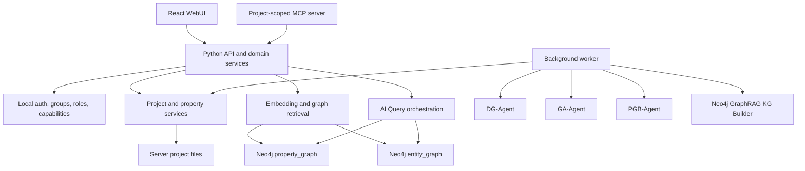

The server-side filesystem contains:

```text
<program directory>/
  conf/                  # system, user, provider, role, and operational state
  projects/
    <stable-project-id>/
      properties/        # original uploads
      extracted-text/    # normalized text for text properties
      jobs/              # optional job artifacts
```

Canonical property, attribute, entity, graph, and vector records are stored in Neo4j. Operational lock/job state may use a small durable store under `conf/`, but it is not a second property/entity database.

## 6. Whole Interface and UI Layout

The selected project workspace has a top bar, a property-tree-only left panel, and a center tab page. Property Preview and Property Attribute are floating windows over the center workspace.

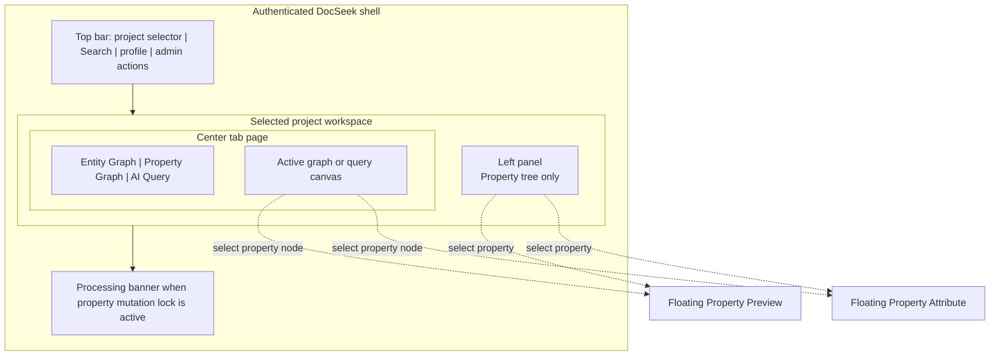

## 7. Module Requirements and UI Designs

### 7.1 Authentication and Session

**Purpose:** Establish local identity and capability claims.

**Requirements:**

- Username/password login backed by the local server configuration store.
- Session contains user, groups, roles, and effective capabilities.
- Disabled users cannot create new sessions.
- Password material is never returned to WebUI/API/MCP callers.
- Logout closes the active project MCP server.

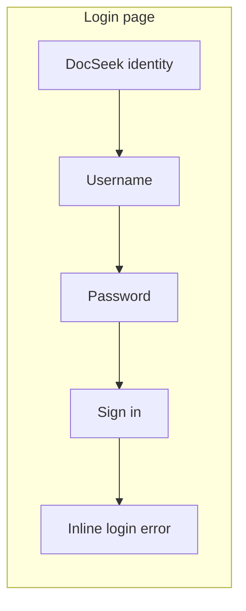

### 7.2 Project Management

**Purpose:** Create and maintain independent named project corpora.

**Requirements:**

- Create Project requires a non-empty unique project name.
- Server assigns stable project ID and creates its file directories.
- Rename changes display name only and is allowed whenever the user has `project.rename`, including during worker processing.
- Delete is blocked during processing and permanently removes project files and Neo4j project records after confirmation.
- All users with `project.view` see the same project catalog; there are no project ACLs.

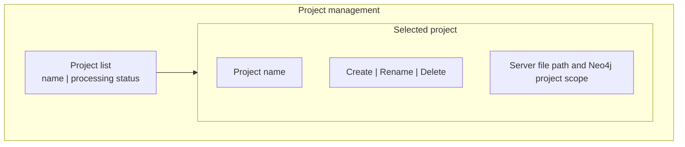

### 7.3 Property Tree and Property Mutation

**Purpose:** Navigate the property pool and start explicit property changes.

**Requirements:**

- Accept text/document/code and image properties.
- Store original files under the selected project.
- Show GA-Agent placement and directory suggestions.
- Upload, Save, Replace, Rename, Move, and Remove require matching capabilities.
- Remove permanently deletes the property and triggers graph/vector cleanup.
- Disable all property mutations while the project lock is active.

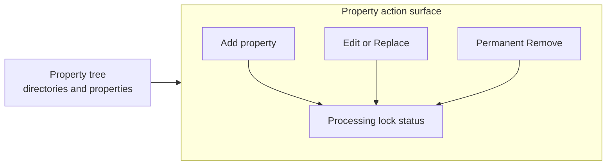

### 7.4 DG-Agent and Definition Generation

**Purpose:** Produce the definition used by graph construction and Search.

**Requirements:**

- For text properties, summarize normalized content into one sentence.
- For image properties, send image input to the configured DG-Agent model and produce a vision definition.
- Use optional user comments as generation context.
- Generate a meaningful filename suggestion from content.
- Show the filename suggestion after processing; user explicitly accepts or revises it.
- The DG-Agent route is the existing LLM route and must support image input for image jobs.

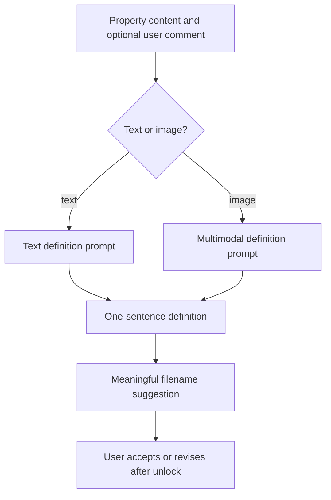

### 7.5 GA-Agent and Smart Grouping

**Purpose:** Arrange properties in a meaningful tree.

**Requirements:**

- Receive property definition and current tree context.
- Propose a directory path and meaningful directory names.
- Apply placement as part of the candidate snapshot.
- Allow users with tree-edit capabilities to customize names after unlock.

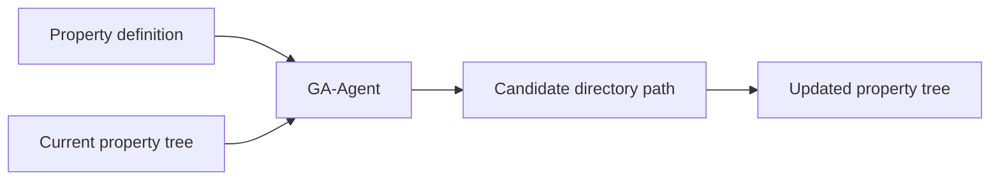

### 7.6 PGB-Agent and Property Graph

**Purpose:** Build relationships between existing property nodes.

**Requirements:**

- Property nodes are created directly from properties, not by PGB-Agent.
- Nodes include stable property ID, name, definition, type, source metadata, and embedding.
- PGB-Agent receives the current property-node inventory and generates edges only.
- Edge output is schema-validated before writing.
- Edges are written to `property_graph` between existing nodes.
- Image properties may be nodes and edge endpoints.

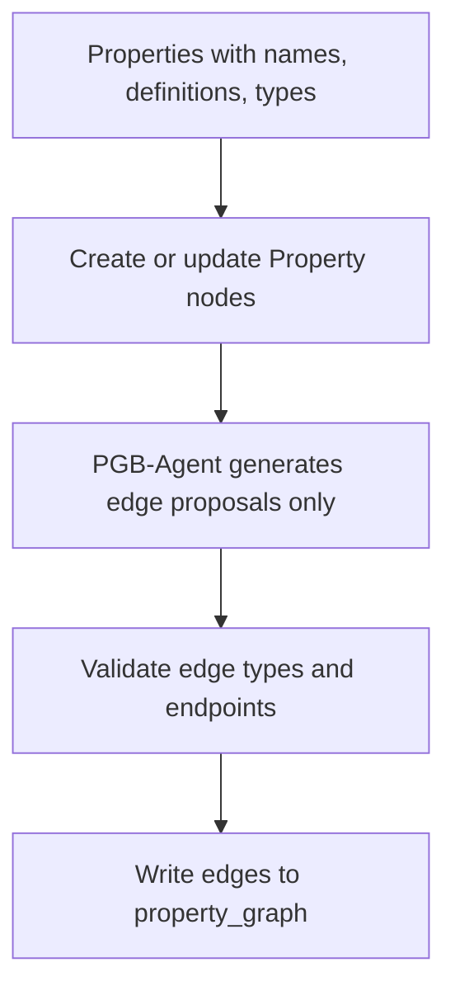

### 7.7 Neo4j GraphRAG Entity Graph

**Purpose:** Extract and persist entities and relationships from all current text properties.

**Requirements:**

- Read every current non-image text property document in the project.
- Exclude image properties completely from Entity Graph input.
- Use the fixed system-wide DocSeek entity schema and extraction prompt.
- Use Neo4j GraphRAG KG Builder for chunking, entity/relation extraction, graph writing, and entity resolution.
- Write to the `entity_graph` named Neo4j database.
- Store source property IDs on documents/chunks or relationships for traceability.
- Rebuild from the complete remaining text corpus after property removal.

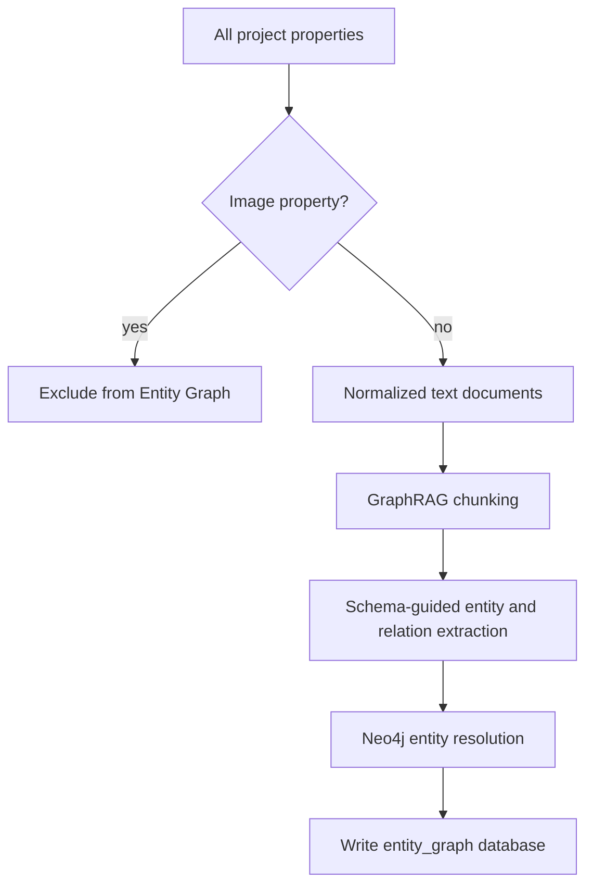

### 7.8 Property Graph View

**Purpose:** Show the complete property graph for the selected project.

**Requirements:**

- Query property nodes and PGB-Agent edges from `property_graph`.
- Show every property by default.
- Support search, filter, zoom, fit-all, focus, and reset.
- Selecting a property opens floating Property Preview and Property Attribute.

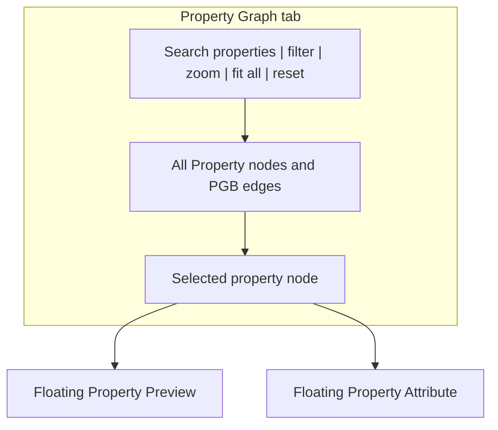

### 7.9 Entity Graph View

**Purpose:** Show the complete entity graph for the selected project.

**Requirements:**

- Query all entity nodes and relationships from `entity_graph`.
- Show aggregation entities and entity relationships.
- Support search, filter, zoom, fit-all, focus, and reset.
- Selecting a property-linked source opens the floating property windows.

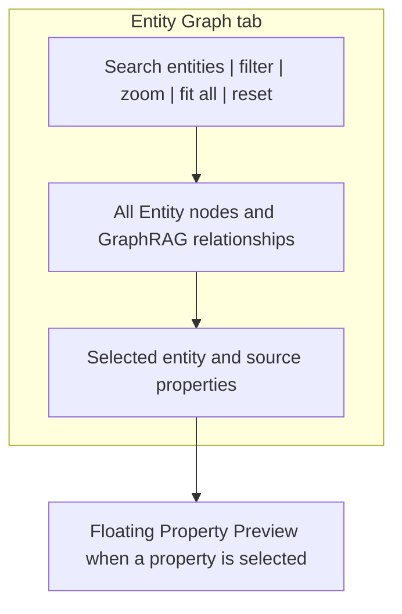

### 7.10 Property Preview and Property Attribute

**Purpose:** Inspect the selected property without changing the center tab.

**Requirements:**

- Open from the property tree or Property Graph.
- Render image properties as images.
- Render supported text/document/code formats.
- Property Attribute reads definition, filename suggestion/status, and property-node metadata from `property_graph`.
- Edit controls are hidden or disabled during project processing.

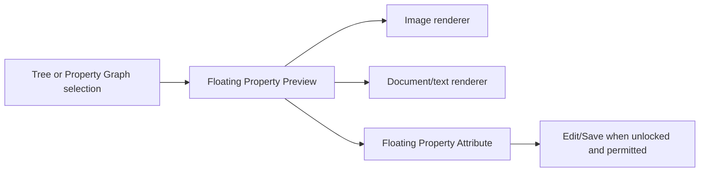

### 7.11 Natural-Language Search

**Purpose:** Return matching Properties and Entities without generating an LLM answer.

**Requirements:**

- Use the shared embedding route for the query.
- Search vector indexes and graph context in both Neo4j databases.
- Return one combined result page grouped into Properties and Entities.
- Never invoke an LLM.
- Property results open Preview/Attribute; Entity results focus Entity Graph.

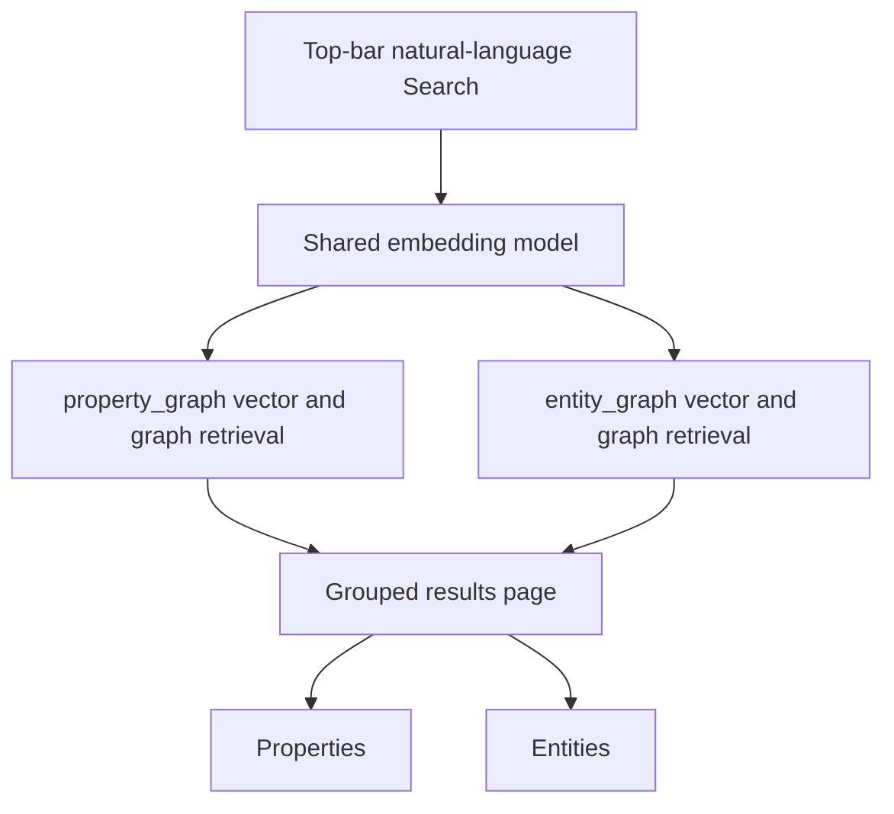

### 7.12 AI Query

**Purpose:** Generate an answer from both project graphs and source context.

**Requirements:**

- Embed and retrieve relevant context from both Neo4j databases.
- Include Property Graph relationships, Entity Graph relationships, definitions, and source chunks.
- Route the combined context to the configured AI Query LLM.
- Return citations to properties and relevant entities.
- Keep AI Query separate from Search; Search has no LLM step.

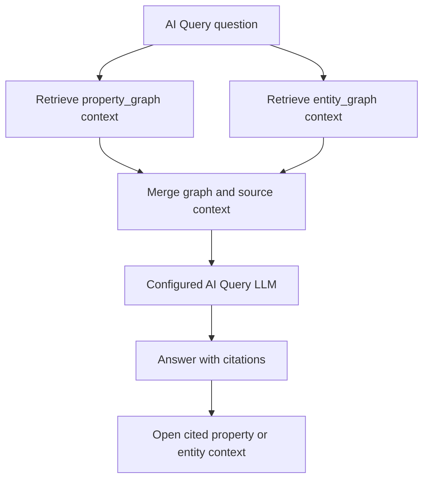

### 7.13 Processing Status and Consistency Lock

**Purpose:** Show the active pipeline and protect graph consistency.

**Requirements:**

- Lock every property mutation in the project while a worker pipeline runs.
- Keep read-only tree, graph, Preview, Attribute, Search, and AI Query views available.
- Show current stage, retry action, and failure details to authorized users.
- Use candidate snapshot IDs and activate only complete graph/index state.
- Recover stale jobs after restart.

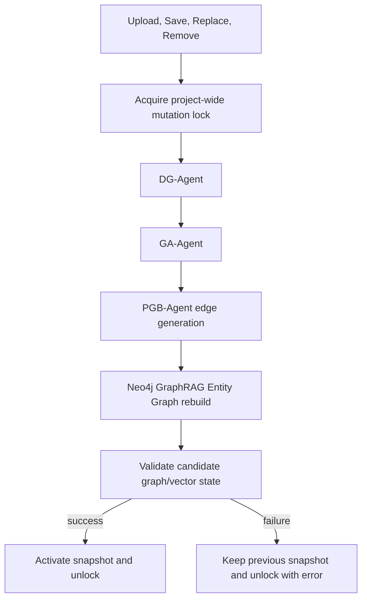

### 7.14 System Configuration

**Purpose:** Configure providers, Neo4j, the fixed entity schema, storage, and MCP settings.

**Requirements:**

- Create and validate multiple LLM provider profiles.
- Create and validate multiple embedding provider profiles.
- Select DG-Agent, GA-Agent, PGB-Agent, and AI Query LLM routes.
- Select one shared embedding route.
- Configure Neo4j URI, credentials, named databases, and index readiness.
- Edit the system-wide Entity Graph schema and extraction prompt.
- Validate server property-file directories.
- Configure MCP endpoint enablement settings.

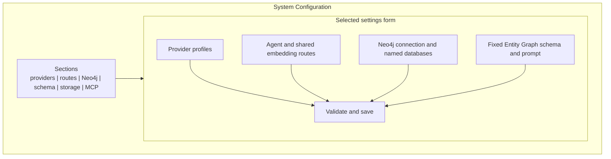

### 7.15 User, Group, and Role Administration

**Purpose:** Manage local users and global role capabilities.

**Requirements:**

- Create/disable users with `user.manage`.
- Create groups and memberships with `group.manage`.
- Create custom roles and action grants with `role.manage`.
- Assign roles only to groups.
- Show effective capabilities.
- Keep Superuser immutable.

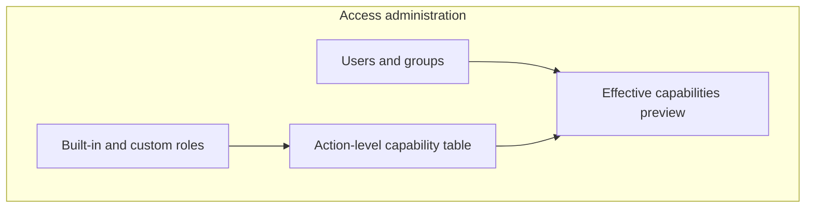

### 7.16 User Profile

**Purpose:** Manage personal account settings without self-elevation.

**Requirements:**

- Show account status and read-only group/role memberships.
- Allow password change and logout.
- Store personal preferences under `conf/`.
- Never allow self-assignment of roles or capabilities.

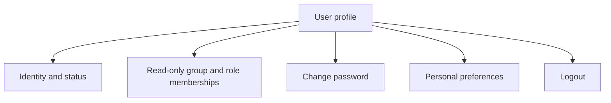

### 7.17 MCP Management and Server

**Purpose:** Manually expose selected capabilities for the currently open project.

**Requirements:**

- MCP is closed when a project opens.
- User explicitly opens MCP from MCP Management.
- One endpoint follows the currently selected project while open.
- No separate MCP authentication is required.
- Endpoint is network-accessible without authentication.
- Every tool operation inherits and checks the WebUI user capabilities that opened MCP.
- Close MCP stops the endpoint.
- Close project, logout, or project switch stops the old endpoint.
- Project switch never auto-opens MCP for the new project.
- MCP exposes no project-management tools.

Tool contract:

| Tool | Purpose |
| --- | --- |
| `list_properties` | List properties in the implicit active project. |
| `get_property` | Return property metadata/content reference. |
| `get_property_attribute` | Return definition and property metadata. |
| `add_property` | Add a property and acquire the project lock. |
| `replace_property` | Replace a property and acquire the project lock. |
| `remove_property` | Permanently remove a property and acquire the project lock. |
| `list_entities` | List Entity Graph entities. |
| `get_entity` | Return one entity and graph context. |
| `search_properties` | Embedding/graph-only property search. |
| `search_entities` | Embedding/graph-only entity search. |
| `get_property_graph` | Retrieve Property Graph data. |
| `get_entity_graph` | Retrieve Entity Graph data. |
| `ask_ai_query` | Retrieve both graphs and generate an answer with the AI Query LLM. |
| `get_processing_status` | Return current lock and worker status. |

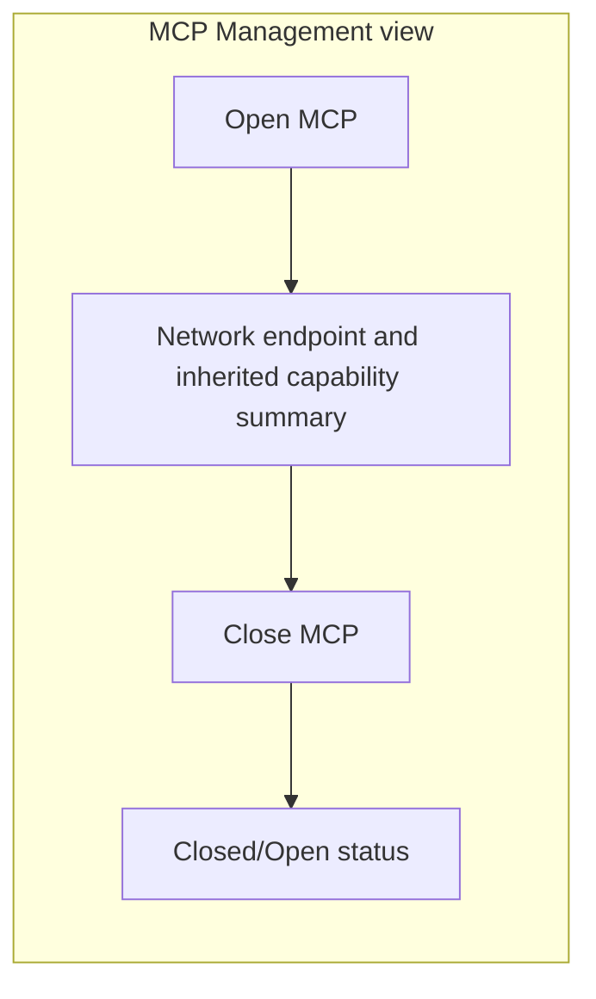

## 8. Data and Graph Requirements

### 8.1 Property Graph node shape

Each Property node in `property_graph` must include, at minimum:

- Stable property ID.
- Project ID.
- Display filename and property type.
- Original-file reference.
- DG definition.
- Filename suggestion and processing status.
- Shared embedding reference/vector index fields.
- Source timestamps needed for operational display.

PGB-Agent edges reference existing stable Property node IDs. The agent cannot introduce an edge endpoint that is not a current property node.

### 8.2 Entity Graph shape

Neo4j GraphRAG stores entities and relationships in `entity_graph` using the fixed DocSeek schema. Text documents/chunks retain source property IDs so entity results can link back to Property Preview. The Entity Graph database is the canonical source for entity lists, entity metadata, and entity relationships.

### 8.3 Snapshot and recovery state

Operational state records:

- Project lock owner and lock status.
- Job ID, current stage, heartbeat, and retry details.
- Candidate snapshot ID and active snapshot ID.
- Provider/model route captured at job start.
- Neo4j readiness and index status.

These records may be stored in a durable store under `conf/`; they do not duplicate Property or Entity nodes.

## 9. Agent and GraphRAG Contracts

| Component | Input | Output |
| --- | --- | --- |
| DG-Agent | Property content, optional user comment | Definition and filename suggestion |
| GA-Agent | Definition and current property tree | Candidate tree placement and directory name |
| PGB-Agent | Existing property node inventory, names, definitions, relation rules | Edge proposals only |
| Neo4j GraphRAG KG Builder | All current non-image text documents, fixed schema, fixed prompt, shared embedding route | Entity nodes, entity relationships, source references, entity resolution |
| Search | Natural-language query and shared embedding route | Grouped Properties and Entities, no LLM answer |
| AI Query | Question, both graph retrieval contexts, source chunks | Grounded answer and citations |

Every graph write is schema-validated. Invalid output never becomes active state.

## 10. Core User Workflows

### 10.1 Create and rename a project

1. User chooses Create Project.
2. UI requires a project name.
3. API checks `project.create`, validates uniqueness, and creates a stable project ID.
4. User may rename the display name whenever `project.rename` is granted.

### 10.2 Add or edit a property

1. User chooses Add, Edit, or Replace.
2. API checks capability and project lock.
3. Server writes the original file and begins the locked pipeline.
4. DG-Agent generates definition and filename suggestion.
5. Property node/embedding, PGB edges, and text-only Entity Graph candidate are built.
6. Complete candidate activates or the previous active state remains.
7. User accepts or revises filename after unlock.

### 10.3 Remove a property

1. User confirms permanent removal.
2. API checks `property.delete` and project lock.
3. Original property, Property node, embedding, PGB edges, and derived references are removed in the candidate rebuild.
4. Entity Graph rebuilds from the remaining non-image text properties.
5. Candidate activates or previous state remains on failure.

### 10.4 Search

1. User enters a natural-language query in the top Search bar.
2. Query is embedded with the shared embedding model.
3. Neo4j vector/graph retrieval runs against both databases.
4. UI presents grouped Property and Entity results.
5. No LLM call is made.

### 10.5 AI Query

1. User enters a question in AI Query.
2. Both Neo4j graphs are retrieved.
3. Relevant source chunks, definitions, properties, and entities are merged.
4. Configured AI Query LLM generates a cited answer.

### 10.6 MCP

1. User opens a project; MCP remains closed.
2. User opens MCP manually in MCP Management.
3. Endpoint binds to the project and inherits current WebUI capabilities.
4. Third-party callers use listed tools without a second authentication step.
5. Close MCP, close project, logout, or switch project stops the endpoint.
6. A new project requires a new manual Open MCP action.

## 11. Failure and Recovery Requirements

- Parser or DG-Agent failure prevents candidate activation.
- PGB-Agent failure prevents candidate Property Graph edge activation.
- Neo4j GraphRAG failure prevents candidate Entity Graph activation.
- Search failure returns retrieval error and never falls back to an LLM.
- AI Query failure preserves the question and offers retry.
- Neo4j connection or index failure leaves previous active graphs readable.
- Provider configuration failure leaves the last valid route active.
- Worker/server restart recovers stale jobs and clears/requeues locks.
- A network caller cannot open MCP; only the WebUI user can manually open it.
- MCP automatically closes on project close, logout, or project switch, but not on inactivity.

## 12. Non-Functional Requirements

- Self-hosted deployment on one server with local or mounted original-file storage.
- Neo4j supports two named databases and vector indexes.
- No property/entity canonical records in SQLite.
- LLM, embedding, parser, and Neo4j connections use adapters/configuration rather than hard-coded providers.
- Search latency does not include answer-generation time because Search never invokes an LLM.
- UI clearly distinguishes Search from AI Query.
- Credentials are never rendered in clear text.
- Network-exposed unauthenticated MCP displays a prominent risk warning in MCP Management.

## 13. Verification Strategy

- Unit tests for capability resolution, project naming/rename, lock state, snapshot transitions, provider routing, and image/text branching.
- Neo4j integration tests for two named databases, node/edge schemas, vector indexes, PGB edge-only writes, GraphRAG extraction, entity resolution, and source references.
- Image tests for preview, DG model input, Property Graph inclusion, definition embedding, and Entity Graph exclusion.
- Search tests proving grouped Property/Entity retrieval and zero LLM invocation.
- AI Query tests proving both graph databases contribute context and citations resolve.
- React end-to-end tests for project forms, property tree, image preview, overlays, graph tabs, Search, AI Query, permissions, and MCP Management.
- MCP tests for manual lifecycle, project switching, inherited capabilities, permanent remove, lock behavior, and network endpoint exposure.
- Restart/recovery tests proving the previous active state remains readable and no project remains permanently locked.

## 14. Release 1 Acceptance Criteria

1. User can create a project by entering a name and rename it later.
2. User can upload text and image properties.
3. Image Preview renders the image, DG-Agent produces a definition, the definition is embedded, and the image is excluded from Entity Graph input.
4. Property Graph contains property nodes and PGB-Agent-generated edges in `property_graph`.
5. Entity Graph contains GraphRAG-extracted entities and relationships in `entity_graph` from all current non-image text.
6. No property or entity canonical records are stored in SQLite.
7. Search returns grouped Property/Entity results without an LLM call.
8. AI Query retrieves from both Neo4j graphs and returns citations.
9. Property mutations lock the project and permanent Remove performs graph/vector cleanup.
10. System Configuration supports LLM profiles, image-capable DG routing, one shared embedding route, Neo4j named databases, and fixed system-wide Entity schema/prompt.
11. Role/group permissions apply identically in WebUI and MCP.
12. MCP opens only manually for an active project, inherits the opener’s capabilities, exposes the documented tools, and closes on MCP close, project close, logout, or project switch.
13. Worker/provider/Neo4j failures preserve the last active state and support recovery.

## 15. Implementation Tracks

1. Runtime foundation, local auth, groups, roles, and capability policy.
2. Project naming, original-file storage, operational state, and project lock.
3. DG-Agent, text/image parsing, preview, definitions, and shared embeddings.
4. PGB-Agent edge generation and `property_graph` Neo4j integration.
5. Neo4j GraphRAG Entity Graph pipeline, fixed schema/prompt, resolution, and `entity_graph` integration.
6. Search, AI Query, graph views, Property Preview/Attribute, and React workbench.
7. System Configuration, MCP Management, MCP transport/tools, and end-to-end verification.
