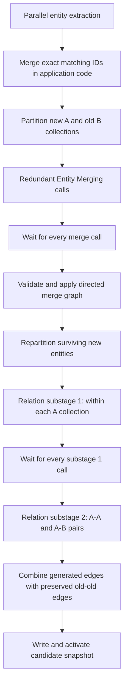

# Batched Entity Merging and Relation Generation Design

**Date:** 2026-08-19

## Goal

Replace the single complete-graph Entity Relation Generation Agent invocation and the single complete-inventory Property Graph Building Agent invocation with bounded, parallel calls over collections of at most 10 nodes. Add a preceding **Redundant Entity Merging** stage so semantic duplicates are resolved before entity relations are generated.

The workflow must keep every model input and output bounded, reuse the user-configured parallel LLM concurrency, preserve existing relations between old entities, and produce deterministic results regardless of worker completion order.

## Scope

This design changes entity merging, entity relation generation, and property relation generation during uploads of new properties. Entity extraction remains a separate workflow. Property removal continues to prune the active snapshot without invoking these stages.

The design covers:

- collection construction and invocation scheduling;
- semantic entity merge proposal generation;
- validation and transitive application of merge proposals;
- two-substage relation generation;
- two-substage property relation generation;
- concurrency, retry, cancellation, and atomicity;
- localized progress reporting; and
- focused tests.

## Terminology and Invariants

- `S` is the set of entities extracted from the newly uploaded properties.
- `O` is the set of entities in the active graph before the upload.
- `A1 ... AK` are ordered collections of at most 10 new entities.
- `B1 ... BT` are ordered collections of at most 10 old entities.
- `chunks(X, 10)` preserves the deterministic input order. Therefore `K = ceil(|S| / 10)` and `T = ceil(|O| / 10)` for nonempty sets.
- An entity sent to an `A` collection is a genuinely new entity ID. If an extracted entity has the same ID as an old entity, application code merges its source metadata into the old entity before semantic merge calls. That entity remains old and belongs only to `B`.
- Semantic merge sources must be new entities. Old entities may be merge targets but never merge sources.
- Cross-collection semantic merges have a fixed direction: `Ai -> Aj` only when `i < j`, and `Ai -> Bj` only.
- Existing valid old-to-old relations are carried forward unchanged. No `B-B` relation invocation is made.
- Relation-generation model inputs contain only entity `id`, `name`, and `definition`.

## Pipeline Overview



## Stage 0: Exact-ID Consolidation

Before semantic merge scheduling, consolidate any extracted entity whose ID already exists in `O`:

1. Keep the old entity's ID, name, and definition.
2. Union the new entity's `source_property_ids` and `source_contexts` into the old entity using the existing deterministic metadata merge and context-limit behavior.
3. Remove that extracted entity from `S`.
4. Keep the consolidated old entity in `O`, and therefore in a `B` collection only.

This is not an LLM operation. It prevents the same ID from appearing on both sides of later collection calls.

## Stage 1: Redundant Entity Merging

### Scheduling

Partition the remaining `S` and `O` into ordered collections of at most 10 entities. Schedule these independent invocations:

- one internal invocation `(Ai, Ai)` for every `i`;
- one cross-new invocation `(Ai, Aj)` for every `i < j`; and
- one new-to-old invocation `(Ai, Bj)` for every `i` and `j`.

Do not schedule `B-B` invocations. The number of merge invocations is:

```text
K + K(K - 1)/2 + KT
```

All merge invocations run through a bounded worker pool:

```text
max_workers = min(merge_invocation_count, batch_llm_concurrency)
```

Each worker creates and closes its own chat provider. The stage collects all responses before applying any merge proposal.

### Prompt Contract

Each prompt supplies compact entities:

```json
["entity_id", "entity_name", "entity_definition"]
```

The role-specific system prompt explains that the model identifies redundant entities whose definitions describe the same entity. It must reject entities that are only related, similarly named, broader, narrower, components, or distinct versions.

The user prompt states the allowed direction for its call:

- internal `Ai`: source and target must both belong to `Ai`;
- `Ai-Aj`: source must belong to `Ai`, target must belong to `Aj`;
- `Ai-Bj`: source must belong to `Ai`, target must belong to `Bj`.

The response is one compact JSON object:

```json
{
  "merges": [
    ["source_entity_id", "target_entity_id"]
  ]
}
```

An empty `merges` list is a valid successful response.

### Per-Response Validation and Retry

A merge item is valid only when:

- it is a two-element list with nonempty IDs;
- both endpoints exist in that invocation;
- source and target differ;
- the source is a new entity; and
- the endpoints obey the invocation's direction and collection membership rules.

Duplicate valid items are collapsed. Response handling is:

- Invalid JSON, a non-object top level, or a missing/non-list `merges` value triggers the existing retry policy.
- An empty `merges` list succeeds without retry.
- A nonempty list containing at least one valid item succeeds; invalid items are ignored without retry.
- A nonempty list in which every item is invalid triggers retry.
- Exhausting retries fails the job. No proposal from any invocation is applied.

### Global Merge Graph

After every invocation succeeds, combine all valid proposals into one directed graph. Processing must not depend on future completion order.

Cross-collection edges are acyclic by their collection direction. Internal `Ai` proposals can conflict or form cycles. Compute strongly connected components in `O(V + E)` time and discard every proposal edge whose endpoints belong to the same cyclic component. A self-edge was already rejected during item validation. Entities affected only by discarded proposals remain unmerged.

The remaining graph is a DAG. Apply it as follows:

1. Initialize every entity with its own stored `source_property_ids` and `source_contexts`.
2. Traverse the DAG in topological order, or equivalently memoize terminal reachability.
3. For every new source, find all reachable terminal targets.
4. Union that source's accumulated metadata into every reachable terminal target using the existing deterministic metadata merge and context-limit behavior.
5. Remove a new entity only if it has at least one surviving outgoing merge edge.
6. Retain all terminal targets, all old entities, and every new entity that is not a source of a surviving merge.

This handles both chains and fan-out:

```text
Entity 1 -> Entity 2 -> Entity 3
```

Entity 3 remains and receives the deduplicated metadata of Entities 1, 2, and 3. Entities 1 and 2 are removed.

```text
Entity 1 -> Entity 2
Entity 1 -> Entity 3
```

Entity 1 is removed, while both terminal targets receive Entity 1's metadata.

Metadata deduplication uses:

- property IDs keyed by the property ID; and
- source contexts keyed by `(property_id, text)`.

No relation remapping is needed. A removable source is always newly extracted and relation generation has not started, so it has no existing relations. Old entity IDs never change.

## Stage 2: Batched Entity Relation Generation

After merge application, rebuild `A` from all surviving genuinely new entities. This includes new entities that were never mentioned in a valid merge proposal and new entities used only as merge targets. Old merge targets remain in `B`, because merging changes only their source metadata and not the `id`, `name`, or `definition` supplied to relation prompts.

Repartition the surviving `A` set into ordered collections of at most 10. The old `B` collections remain based on the consolidated old inventory.

### Substage 1: Relations Within New Collections

Submit one invocation for every `Ai`. Each call may return only directed relations whose source and target are distinct members of that same collection.

All calls run concurrently with the user-configured concurrency limit. Substage 2 must not start until every Substage 1 invocation succeeds.

### Substage 2: Relations Between Collections

Submit these unordered collection pairs:

- `(Ai, Aj)` for every `i < j`; and
- `(Ai, Bj)` for every `i` and `j`.

Each invocation permits either relation direction between the two supplied collections. Every returned edge must have one endpoint in each collection. Edges with both endpoints in the first collection or both endpoints in the second collection are invalid.

All calls run concurrently with the same user-configured limit.

### Prompt and Response Contract

Each relation prompt receives only compact entity identity data:

```json
["entity_id", "entity_name", "entity_definition"]
```

The prompt requests only meaningful, evidence-backed directed relations, permits disconnected entities, prohibits relations inferred from mere similarity or co-occurrence, and clearly states the invocation's endpoint restrictions.

Each response is one compact JSON object:

```json
{
  "edges": [
    ["source_entity_id", "target_entity_id", "relation_type"]
  ]
}
```

Validation requires:

- a valid JSON object with an `edges` list;
- three-element edge items;
- known, distinct endpoints;
- endpoints allowed by the invocation's collection contract; and
- a nonempty normalized Unicode relation type.

Relation responses retain the existing strict retry-and-fail behavior. Valid edges from all invocations are combined and duplicate `(source, target, type)` triples are removed deterministically.

### Final Edge Set

The final entity edge set is:

```text
valid preserved old-old edges
+ valid Substage 1 edges
+ valid Substage 2 edges
```

Preserved edges are filtered to existing final entity IDs and normalized using the existing edge rules. No `B-B` LLM revalidation is performed. Because every unordered pair involving a surviving new entity belongs to exactly one invocation, generated endpoint pairs do not overlap across calls.

## Stage 3: Batched Property Relation Generation

Property relation generation uses the same two-substage collection strategy, but has no semantic merge stage.

### Property Collection Sets

For the current workflow, define:

- `PS` as the set of property nodes newly uploaded or explicitly processed by this operation;
- `PO` as all other property nodes in the final candidate property inventory.

For a full rebuild with no active property graph, every final property node belongs to `PS`. For an incremental upload or update, the operation's batch property IDs (or the single processed property ID) belong to `PS`; all remaining properties belong to `PO`.

Partition `PS` into ordered collections `P1 ... PK` of at most 10 and `PO` into ordered collections `Q1 ... QT` of at most 10. Collection order is deterministic and follows the final property inventory order.

Property relation calls receive compact metadata only: property `id`, `filename`, `definition`, and `property_type`. They never receive full content, embeddings, or unrelated payload fields.

### Property Relation Substage 1

Submit one Property Graph Building Agent invocation for each `Pi`. It may return directed property relations only when both endpoints belong to that same collection. Calls run concurrently with the configured `batch_llm_concurrency` limit.

### Property Relation Substage 2

After all Substage 1 calls finish, submit:

- `(Pi, Pj)` for every `i < j`; and
- `(Pi, Qj)` for every `i` and `j`.

Either relation direction is permitted for a pair, but every edge must have one endpoint in each supplied collection. `Q-Q` calls are not made.

The pair prompt explicitly prohibits same-side edges and permits isolated properties. It uses the same compact `{"edges":[["source","target","type"]]}` response shape and strict endpoint/type validation as entity relation generation. Invalid relation responses retain the existing retry-and-fail behavior.

### Property Edge Aggregation

Preserve only existing edges whose two endpoints are both in `PO`. Add validated edges from Property Relation Substage 1 and Substage 2, deduplicating `(source, target, type)` triples. Edges involving a property in `PS` are regenerated by the two substages, so stale relations for changed properties are not carried forward.

The property relation invocation count is:

```text
K + K(K - 1)/2 + KT
```

This is independent of the entity merge and relation invocation counts, and both property relation substages use the same bounded worker-pool and cancellation rules.

## Concurrency, Cancellation, and Atomicity

The Redundant Entity Merging stage and both relation substages each use their own bounded worker pool:

```text
max_workers = min(invocation_count, batch_llm_concurrency)
```

Zero-invocation stages complete immediately without creating a worker pool. The existing job heartbeat remains active while futures are running.

Cancellation is checked while futures complete. Pending futures are cancelled where possible, all opened providers are closed, and no candidate snapshot from the incomplete workflow is activated.

Merge proposals are applied only after all merge invocations succeed. Relation edges are assembled only after all required relation invocations succeed. Exhausted retries in any required invocation fail the job, preserving the currently active snapshot.

## Progress and Localization

Add a distinct processing stage whose visible English label is:

```text
Redundant Entity Merging
```

Its Chinese label is:

```text
冗余实体合并
```

The merge stage reports these localized details:

```text
Generating redundant entity merge proposals. <COMPLETED>/<TOTAL>
Applying redundant entity merges
```

Their Chinese translations are:

```text
正在生成冗余实体合并建议。<COMPLETED>/<TOTAL>
正在应用冗余实体合并
```

Both relation substages share one user-facing progress message:

```text
Generating relations for entities. <PROGRESS_PERCENT%>
```

Let:

```text
completed = completed_substage_1_calls + completed_substage_2_calls
total = total_substage_1_calls + total_substage_2_calls
PROGRESS_PERCENT = floor(100 * completed / total)
```

Clamp the result to `0..100`. When `total = 0`, report `100%`. Emit an update after every completed relation invocation. The Substage 1 barrier remains internal; users see one continuous aggregate percentage.

All visible strings are added to the i18n resources with complete English and Chinese translations. Chinese translations use the canonical nouns `资产` for property and `实体` for entity.

Property relation generation has its own processing detail:

```text
Generating property relations. <PROGRESS_PERCENT%>
```

Its percentage is calculated from the completed and total calls across both Property Relation substages using the same floor-and-clamp formula. When the property total is zero, report `100%`. Its Chinese translation is:

```text
正在生成资产关系。<PROGRESS_PERCENT%>
```

## Component Boundaries

Keep orchestration and model contracts independently testable:

- Collection helpers deterministically partition inventories and enumerate merge/relation call specifications.
- A merge-call function owns prompt construction, provider lifecycle, parsing, and per-item validation.
- A merge-graph function owns cycle filtering, terminal reachability, metadata propagation, and source removal without calling an LLM.
- A relation-call function owns prompt construction, provider lifecycle, parsing, and endpoint validation for one call specification.
- The pipeline owns stage barriers, progress, cancellation, aggregation, and snapshot atomicity.

`GraphRAGBuilder` may expose these operations, but the pure scheduling and merge-graph logic should remain isolated from provider code so it can be unit tested without constructing the full pipeline.

## Focused Test Strategy

Do not run full-volume tests. Add focused unit tests for:

### Collection Scheduling

- collection sizes at 0, 1, 10, 11, and larger boundaries;
- deterministic ordering;
- internal `Ai`, `Ai-Aj`, and `Ai-Bj` merge schedules;
- absence of `B-B` calls;
- relation Substage 1 and Substage 2 schedules; and
- no worker-pool construction for zero invocations.

### Merge Responses

- empty `merges` accepted;
- a mixture of valid and invalid items accepted without retry;
- a nonempty wholly invalid list retried;
- malformed structure retried;
- direction and membership validation for every call kind;
- duplicate proposals collapsed; and
- exhausted retry fails before merge application.

### Merge Graph

- exact-ID consolidation into old entities;
- a transitive chain such as `1 -> 2 -> 3`;
- fan-out to multiple terminal targets;
- source property and context deduplication;
- internal cycles discarded deterministically;
- unmentioned new entities retained;
- valid merge sources removed;
- target-only new entities retained; and
- old entities never removed.

### Relation Generation

- within-collection endpoint validation;
- cross-collection endpoint validation in either direction;
- same-side cross-call edges rejected;
- Substage 2 starts only after all Substage 1 futures finish;
- configured concurrency is not exceeded;
- generated edge deduplication; and
- old-old relations are preserved unchanged.

### Property Relation Generation

- changed/new property collection partitioning;
- property Substage 1 and Substage 2 schedules;
- no `Q-Q` calls;
- compact metadata prompts exclude content and embeddings;
- changed-property edges are regenerated while unchanged `PO-PO` edges are preserved;
- property aggregate progress across both substages; and
- configured concurrency and Substage 1/Substage 2 barrier behavior.

### Pipeline and UI Progress

- merge application waits for all proposal calls;
- failed calls do not activate a partial snapshot;
- aggregate relation percentage uses the combined call total;
- percentage progresses across the substage barrier and ends at 100%; and
- English and Chinese stage labels/details are registered.

Run independent focused backend test files in parallel where practical, plus only the relevant frontend processing-status and i18n tests.

## Out of Scope

- Revalidating semantic duplicates among old entities.
- Rebuilding old-to-old relations during an upload.
- Adding a separate concurrency setting for these stages.
- Passing source contexts or full property text to relation-generation prompts.
- Changing property removal behavior.
